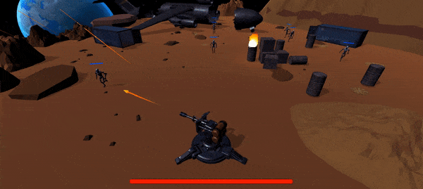

# Tower-Defense-Game

## Description:
this is a game made with Unity, the goal is to protect the tower against robots.

## ScreenShot:

## Tools & languages:
* Unity (game Engine)
* C# (Script Code)
* Visual Studio Code (Text editor)
* Unity Collab (Collaboration tool)

## Contribution:
Feel free to fork this project and add whatever you like. If you have any suggestions or any comments please feel free to contact me or to open an issue, use free license art assets please.

## Team:
[Jetlighters](https://github.com/JetLightStudio) having fun.

### Special thanks:
my BestFriend and tutor  

### PS:
all assets are available at assetStore
 
